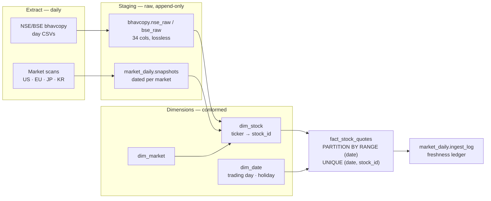

# Stock Data Warehouse — Audit & Target Architecture

*Audited 2026-07-15 against `market_data` · PostgreSQL 16.14 (Homebrew). All row counts,
index definitions and duplicate checks below are live query results, not estimates.*

An audit of the multi-market OHLCV warehouse behind the daily brief, and a date-partitioned
star schema to replace the parallel silos it grew instead.

---

## 1. Where the data actually is

The warehouse **already has a star schema** — `ohlcv_history` as the fact table, `stocks` and
`markets` as dimensions. Its shape is not the problem. The problem is that almost nothing was
ever loaded into it, while a second, denormalized copy of India grew up beside it.

| Market  | Dim stocks | Fact rows | Fact coverage                  | State  |
|---------|-----------:|----------:|--------------------------------|--------|
| china   |      5,825 |   825,082 | 2011-01-04 → 2026-07-06        | loaded |
| japan   |      3,709 |         0 | —                              | empty  |
| korea   |      3,184 |         0 | —                              | empty  |
| india   |      2,415 |         0 | 1.9M rows stranded in staging  | empty  |
| usa     |      1,521 |         0 | —                              | empty  |
| europe  |      1,442 |         0 | —                              | empty  |
| uk      |      1,042 |         0 | —                              | empty  |
| germany |        173 |         0 | —                              | empty  |

The dimension is populated for every geography; the fact table for exactly one.

## 2. Market-wise freshness ledger

There was no record of when each geography last received real data. There is now: every ingest
writes `market_daily.ingest_log`, and `market_ingest.py --status` renders it.

| Market | Geography    | Last data  | Age | Rows      | Source   | Status |
|--------|--------------|------------|----:|----------:|----------|--------|
| india  | NSE/BSE      | 2026-07-13 |  2d | 1,905,157 | bhavcopy | fresh  |
| us     | NASDAQ/NYSE  | 2026-07-14 |  1d |     6,255 | scan     | fresh  |
| europe | 17 exchanges | 2026-07-14 |  1d |       921 | scan     | fresh  |
| japan  | TSE          | 2026-07-14 |  1d |     2,893 | scan     | fresh  |
| korea  | KOSPI/KOSDAQ | 2026-07-14 |  1d |     2,635 | scan     | fresh  |

India lags a day because bhavcopy publishes EOD; the rest are snapshot scans. Re-running the
ingest appends **0 rows** — a market/date already present is never re-inserted.

## 3. What the audit found

### Dimension tickers hold company names — *data quality, blocking*
`stocks.ticker` is populated with names rather than symbols for part of the dimension —
`Marico Ltd`, `Jubilant FoodWorks Ltd`. Any staging→fact join on ticker silently drops these rows.

Name-like tickers: **korea 416 · europe 93 · india 35 · china 1**. India still matched 2,328 of
2,746 bhavcopy symbols, so the dimension is *mixed*, not uniformly broken — which is worse,
because it fails quietly.

### Two parallel stores for the same market — *duplication*
India exists twice: 9.5M denormalized rows in `bhavcopy.*`, and an empty slot in the fact table.
Nothing reconciles them. The silo is the thing the star schema was built to prevent.

### No `dim_date` — *missing*
Date attributes (trading day, fiscal period, exchange holiday) have nowhere to live, so calendar
logic is re-derived ad hoc in each script. The NSE holiday list sits in a loose
`nse_holidays.json` instead of the warehouse.

### TimescaleDB unavailable — *constraint*
Not installed and not in `pg_available_extensions`; only `plpgsql` is present. Hypertables are
out. Native declarative **range partitioning by date** is the equivalent and needs no extension.

### The fact table itself is sound — *verified*
`UNIQUE (stock_id, date)` already exists with **0** duplicate pairs, and both `(date)` and
`(stock_id, date)` are indexed. That unique constraint is what makes an idempotent `ON CONFLICT`
append possible — the load can be built on it as-is.

## 4. Target architecture

Raw batches land in staging untouched, get conformed against the dimensions, then append into a
date-partitioned fact table. Staging stays denormalized on purpose: it is the replay buffer when
a dimension fix means reprocessing history.



### Load sequence

Order matters — each step depends on the one before it.

1. **Land** — write the raw batch to staging with its source filename and trade date. Never
   transform on the way in.
2. **Conform** — upsert unseen symbols into `dim_stock`, keyed by `(market_id, ticker)`. Repair
   the name-as-ticker rows *before* this becomes the join key for 9.5M rows.
3. **Append** — insert into the fact table with `ON CONFLICT (stock_id, date) DO NOTHING`.
   Idempotent by construction.
4. **Log** — record market, last data date, rows appended, status. The ledger is the contract
   that the routine ran and what it saw.

### Schema changes

Date leads the index, so range scans and ordering hit it first. Partitioning by year keeps each
child small enough that the daily append only touches the current partition.

```sql
-- dim_date: the missing dimension. Trading-day and holiday logic belongs
-- here, not re-derived in every script from a loose JSON file.
CREATE TABLE dim_date (
  date_key       DATE PRIMARY KEY,
  year           SMALLINT, quarter SMALLINT, month SMALLINT,
  day_of_week    SMALLINT,
  is_weekday     BOOLEAN,
  is_nse_holiday BOOLEAN DEFAULT false,
  is_trading_day BOOLEAN            -- per-market calendars via dim_market_calendar
);

-- fact: date-first key, range-partitioned. No extension required.
CREATE TABLE fact_stock_quotes (
  date        DATE    NOT NULL REFERENCES dim_date(date_key),
  stock_id    INTEGER NOT NULL REFERENCES stocks(stock_id),
  open_price  NUMERIC, high_price NUMERIC,
  low_price   NUMERIC, close_price NUMERIC,
  adj_close   NUMERIC, volume BIGINT,
  source      VARCHAR(32) NOT NULL,     -- bhavcopy | scan | yfinance
  PRIMARY KEY (date, stock_id)          -- date leads: time-range scans first
) PARTITION BY RANGE (date);

CREATE TABLE fact_stock_quotes_2026 PARTITION OF fact_stock_quotes
  FOR VALUES FROM ('2026-01-01') TO ('2027-01-01');

-- the append. Idempotent: re-running a day inserts nothing.
INSERT INTO fact_stock_quotes (date, stock_id, open_price, high_price,
                               low_price, close_price, volume, source)
SELECT b.trade_date, s.stock_id, b.open, b.high, b.low, b.close, b.volume, 'bhavcopy'
FROM   bhavcopy.bhavcopy_ohlcv b
JOIN   stocks s ON s.market_id = 1 AND s.ticker = b.symbol
WHERE  b.trade_date > (SELECT COALESCE(max(date), '1900-01-01')
                       FROM fact_stock_quotes WHERE source = 'bhavcopy')
ON CONFLICT (date, stock_id) DO NOTHING;
```

**Why both the `WHERE` clause and `ON CONFLICT`?** The high-water mark keeps the daily job from
scanning 9.5M staged rows to insert 5,000; the conflict clause is the correctness backstop when a
late-arriving date needs replay.

## 5. Storage

Separate from the schema work, the repository carried **37 GB of orphaned temp packs** from
interrupted `gc`/`filter-repo` runs — `tmp_pack_*` files git itself classified as garbage because
they have no `.idx` and cannot be read.

| Metric        | Now  | Before | Note                                  |
|---------------|-----:|-------:|---------------------------------------|
| `.git`        | 5.5G |    43G | 37.5 GB reclaimed, `fsck` clean       |
| bhavcopy store| 272M |   764M | DuckDB vs CSV+parquet duplication     |
| LFS churn/day |    0 |  ~120M | regenerated blobs, now gitignored     |

- **The CSVs were redundant.** `nse.parquet`/`bse.parquet` reproduce the 538 raw day-CSVs
  losslessly — 34/34 columns, 269/269 dates, verified both directions before anything was ignored.
- **Parquet is the wrong shape for LFS.** It's binary, so git stores no delta: every run of a
  regenerated file becomes a new permanent blob. Those paths are gitignored; Postgres holds the
  durable copy.
- **LFS prune declined.** 10,804 of 10,962 local objects are unreferenced (~3.4 GB). Given this
  tree's history of failed LFS pushes and mass wipes, `--verify-remote` is a prerequisite before
  reclaiming it.

## 6. Status

| Component               | State     | Detail                                             |
|-------------------------|-----------|----------------------------------------------------|
| Staging — India         | done      | 9.5M rows, 5 tables, row/col parity verified       |
| Staging — US/EU/JP/KR   | done      | dated snapshots, idempotent append                 |
| Freshness ledger        | done      | `market_daily.ingest_log` + status view            |
| Integrity baseline      | done      | 3,331 files SHA256'd; caught a live 35-file wipe   |
| `dim_date`              | designed  | DDL above; not yet created                         |
| Ticker repair           | blocking  | 545 name-as-ticker rows must be fixed first        |
| Fact load               | blocked   | depends on ticker repair                           |
| Partitioning            | designed  | range-by-year; no extension needed                 |

The ticker repair gates the fact load, and it should: joining 9.5M rows through a dimension that
silently drops 545 of them would produce a warehouse that looks complete and isn't.

---

## Scripts

| Script                       | Purpose                                                             |
|------------------------------|---------------------------------------------------------------------|
| `scripts/bhavcopy_to_db.py`  | Consolidate the India bhavcopy cache into DuckDB; `--to-postgres` mirrors with date-wise append. `--verify` proves row/col parity against source parquets. |
| `scripts/market_ingest.py`   | Daily append-only ingest per geography + the freshness ledger. `--status` prints the market-wise table. |
| `scripts/build_audit_manifest.py` | Dated SHA256 manifest of the data tree; `--verify <old.json>` diffs a later run to detect loss or drift. |
