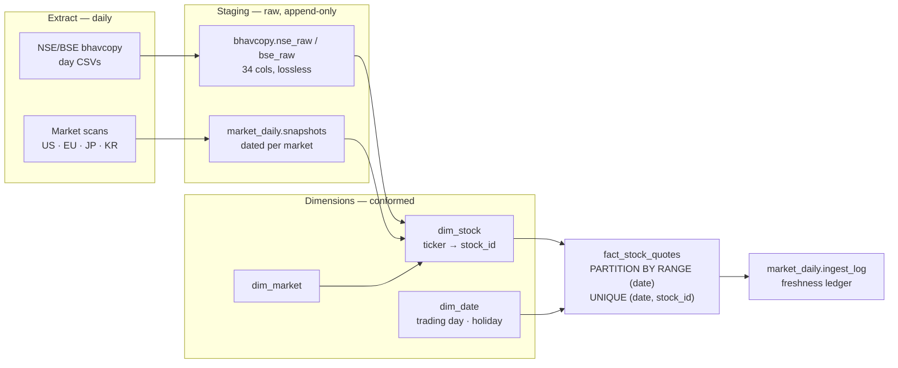

# Stock Data Warehouse — Audit & Target Architecture

*Audited 2026-07-15 against `market_data` · PostgreSQL 16.14 (Homebrew). All row counts,
index definitions and duplicate checks below are live query results, not estimates.*

An audit of the multi-market OHLCV warehouse behind the daily brief, and the conforming load
that finally connected India's 1.27M rows to the star schema built for them and never used.

---

## 1. Where the data actually is

The warehouse **already had a star schema** — `ohlcv_history` as the fact table, `stocks` and
`markets` as dimensions. Its shape was never the problem. The problem was that almost nothing had
ever been loaded into it, while a second, denormalized copy of India grew up beside it. India is
now conformed and loaded; six geographies remain empty.

| Market  | Dim stocks | Fact rows | Fact coverage           | State                 |
|---------|-----------:|----------:|-------------------------|-----------------------|
| india   |      8,986 | 1,272,402 | 2025-06-10 → 2026-07-13 | **loaded 2026-07-15** |
| china   |      5,825 |   825,082 | 2011-01-04 → 2026-07-06 | loaded                |
| japan   |      3,709 |         0 | —                       | empty                 |
| korea   |      3,184 |         0 | —                       | empty                 |
| usa     |      1,521 |         0 | —                       | empty                 |
| europe  |      1,442 |         0 | —                       | empty                 |
| uk      |      1,042 |         0 | —                       | empty                 |
| germany |        173 |         0 | —                       | empty                 |

Before this load the dimension was populated for every geography and the fact table for exactly
one (China). India's 1.27M rows now reach the fact table they were always meant to.

## 2. Market-wise freshness ledger

There was no record of when each geography last received real data. There is now: every ingest
writes `market_daily.ingest_log`, and `market_ingest.py --status` renders it.

| Market | Geography    | Last data  | Age | Rows      | Source   | Status |
|--------|--------------|------------|----:|----------:|----------|--------|
| india  | NSE/BSE      | 2026-07-13 |  2d | 1,905,157 | bhavcopy | fresh  |
| us     | NASDAQ/NYSE  | 2026-07-14 |  1d |     6,255 | scan     | fresh  |
| europe | 17 exchanges | 2026-07-14 |  1d |       921 | scan     | fresh  |
| japan  | TSE          | 2026-07-14 |  1d |     2,893 | scan     | fresh  |
| korea  | KOSPI/KOSDAQ | 2026-07-14 |  1d |     2,635 | scan     | fresh  |

India lags a day because bhavcopy publishes EOD; the rest are snapshot scans. Re-running the
ingest appends **0 rows** — a market/date already present is never re-inserted.

## 3. What the audit found

### Name-as-ticker rows were a red herring — *resolved*
The obvious reading — `stocks.ticker` holding `Marico Ltd` instead of `MARICO` — looked like it
would break the staging→fact join. **It didn't.** Those 35 India rows were *duplicate orphans*: a
correct `MARICO` row already existed, and the bad row carried **0 facts and 0 fundamentals**. A
join on `ticker = symbol` never matches them. They were inert, and are now deleted.

A *rename* would in fact have **failed** — `UNIQUE (ticker, market_id)` collides with the real row.
Still open elsewhere: **korea 416 · europe 93**.

### The real silent-drop risk: 6,606 missing dim rows — *was blocking, now fixed*
The cleaned India series carries **8,974** symbols; the dimension held **2,368**. The other
**6,606** had no dim row at all — an inner join would have dropped their history without a single
error, producing a warehouse that looked complete and wasn't. Fixed by conforming the dimension
from NSE/BSE's own `TckrSymb` + `FinInstrmNm` + `ISIN`.

### NSE/BSE symbol collision — *correctness trap*
BSE uses the **same bare symbol format** as NSE, and **2,534 symbols exist on both**. `dim_stock`
draws no exchange distinction inside `market_id = 1`, so loading the combined `bhavcopy_ohlcv`
would hit `UNIQUE (stock_id, date)` and `ON CONFLICT DO NOTHING` would silently keep whichever
exchange's close arrived first — NSE or BSE, arbitrarily. Avoided by loading `cleaned_ohlcv`,
where NSE precedence is already resolved (verified **0** duplicate (symbol,date) pairs across
1,272,402 rows before it was trusted).

### Fuzzy name matching is not safe here — *method*
Matching dimension names against exchange names fanned out: 35 rows produced 39 matches, with
`LTIMindtree` resolving to both `LTIM` and `LTM`. Identity comes from the exchange's own symbol
and ISIN, not string similarity.

### No `dim_date` — *missing*
Date attributes (trading day, fiscal period, exchange holiday) have nowhere to live, so calendar
logic is re-derived ad hoc in each script. The NSE holiday list sits in a loose
`nse_holidays.json` instead of the warehouse.

### TimescaleDB unavailable — *constraint*
Not installed and not in `pg_available_extensions`; only `plpgsql` is present. Hypertables are
out. Native declarative **range partitioning by date** is the equivalent and needs no extension.

### The fact table itself is sound — *verified*
`UNIQUE (stock_id, date)` already exists with **0** duplicate pairs, and both `(date)` and
`(stock_id, date)` are indexed. That unique constraint is what makes an idempotent `ON CONFLICT`
append possible — the load can be built on it as-is.

## 4. Target architecture

Raw batches land in staging untouched, get conformed against the dimensions, then append into a
date-partitioned fact table. Staging stays denormalized on purpose: it is the replay buffer when
a dimension fix means reprocessing history.



### Load sequence

Order matters — each step depends on the one before it.

1. **Land** — write the raw batch to staging with its source filename and trade date. Never
   transform on the way in.
2. **Conform** — upsert unseen symbols into `dim_stock`, keyed by `(market_id, ticker)`, taking
   name and ISIN from the exchange's own record. This is the step that matters: a *missing* dim
   row drops its history silently on the join.
3. **Append** — insert into the fact table with `ON CONFLICT (stock_id, date) DO NOTHING`.
   Idempotent by construction.
4. **Log** — record market, last data date, rows appended, status. The ledger is the contract
   that the routine ran and what it saw.

### Schema changes

Date leads the index, so range scans and ordering hit it first. Partitioning by year keeps each
child small enough that the daily append only touches the current partition.

```sql
-- dim_date: the missing dimension. Trading-day and holiday logic belongs
-- here, not re-derived in every script from a loose JSON file.
CREATE TABLE dim_date (
  date_key       DATE PRIMARY KEY,
  year           SMALLINT, quarter SMALLINT, month SMALLINT,
  day_of_week    SMALLINT,
  is_weekday     BOOLEAN,
  is_nse_holiday BOOLEAN DEFAULT false,
  is_trading_day BOOLEAN            -- per-market calendars via dim_market_calendar
);

-- fact: date-first key, range-partitioned. No extension required.
CREATE TABLE fact_stock_quotes (
  date        DATE    NOT NULL REFERENCES dim_date(date_key),
  stock_id    INTEGER NOT NULL REFERENCES stocks(stock_id),
  open_price  NUMERIC, high_price NUMERIC,
  low_price   NUMERIC, close_price NUMERIC,
  adj_close   NUMERIC, volume BIGINT,
  source      VARCHAR(32) NOT NULL,     -- bhavcopy | scan | yfinance
  PRIMARY KEY (date, stock_id)          -- date leads: time-range scans first
) PARTITION BY RANGE (date);

CREATE TABLE fact_stock_quotes_2026 PARTITION OF fact_stock_quotes
  FOR VALUES FROM ('2026-01-01') TO ('2027-01-01');

-- the append. Idempotent: re-running a day inserts nothing.
INSERT INTO fact_stock_quotes (date, stock_id, open_price, high_price,
                               low_price, close_price, volume, source)
SELECT b.trade_date, s.stock_id, b.open, b.high, b.low, b.close, b.volume, 'bhavcopy'
FROM   bhavcopy.bhavcopy_ohlcv b
JOIN   stocks s ON s.market_id = 1 AND s.ticker = b.symbol
WHERE  b.trade_date > (SELECT COALESCE(max(date), '1900-01-01')
                       FROM fact_stock_quotes WHERE source = 'bhavcopy')
ON CONFLICT (date, stock_id) DO NOTHING;
```

**Why both the `WHERE` clause and `ON CONFLICT`?** The high-water mark keeps the daily job from
scanning 9.5M staged rows to insert 5,000; the conflict clause is the correctness backstop when a
late-arriving date needs replay.

## 5. Storage

Separate from the schema work, the repository carried **37 GB of orphaned temp packs** from
interrupted `gc`/`filter-repo` runs — `tmp_pack_*` files git itself classified as garbage because
they have no `.idx` and cannot be read.

| Metric        | Now  | Before | Note                                  |
|---------------|-----:|-------:|---------------------------------------|
| `.git`        | 5.5G |    43G | 37.5 GB reclaimed, `fsck` clean       |
| bhavcopy store| 272M |   764M | DuckDB vs CSV+parquet duplication     |
| LFS churn/day |    0 |  ~120M | regenerated blobs, now gitignored     |

- **The CSVs were redundant.** `nse.parquet`/`bse.parquet` reproduce the 538 raw day-CSVs
  losslessly — 34/34 columns, 269/269 dates, verified both directions before anything was ignored.
- **Parquet is the wrong shape for LFS.** It's binary, so git stores no delta: every run of a
  regenerated file becomes a new permanent blob. Those paths are gitignored; Postgres holds the
  durable copy.
- **LFS prune declined.** 10,804 of 10,962 local objects are unreferenced (~3.4 GB). Given this
  tree's history of failed LFS pushes and mass wipes, `--verify-remote` is a prerequisite before
  reclaiming it.

## 6. Status

| Component               | State     | Detail                                             |
|-------------------------|-----------|----------------------------------------------------|
| Staging — India         | done      | 9.5M rows, 5 tables, row/col parity verified       |
| Staging — US/EU/JP/KR   | done      | dated snapshots, idempotent append                 |
| Freshness ledger        | done      | `market_daily.ingest_log` + status view            |
| Integrity baseline      | done      | 3,331 files SHA256'd; caught a live 35-file wipe   |
| India dim conformed     | **done**  | +6,606 rows, 2,812 enriched, 35 orphans dropped, 8,974 with ISIN |
| India fact load         | **done**  | 1,272,402 rows · 0 unmapped · source count = loaded count |
| `dim_date`              | designed  | DDL above; not yet created                         |
| Partitioning            | designed  | range-by-year; no extension needed                 |
| Ticker repair — KR/EU   | open      | korea 416, europe 93 name-like rows still to clean |
| US/EU/JP/KR fact load   | not started | scans emit snapshots, not OHLCV history — needs a series source |

India reconciles exactly: 1,272,402 rows in the source, 1,272,402 in the fact table, 0 symbols
unmapped, RELIANCE's closes matching the source to the paisa. The remaining four geographies
cannot be loaded the same way — their scans produce a daily snapshot, not a price history.

---

## Scripts

| Script                       | Purpose                                                             |
|------------------------------|---------------------------------------------------------------------|
| `scripts/bhavcopy_to_db.py`  | Consolidate the India bhavcopy cache into DuckDB; `--to-postgres` mirrors with date-wise append. `--verify` proves row/col parity against source parquets. |
| `scripts/market_ingest.py`   | Daily append-only ingest per geography + the freshness ledger. `--status` prints the market-wise table. |
| `scripts/build_audit_manifest.py` | Dated SHA256 manifest of the data tree; `--verify <old.json>` diffs a later run to detect loss or drift. |
